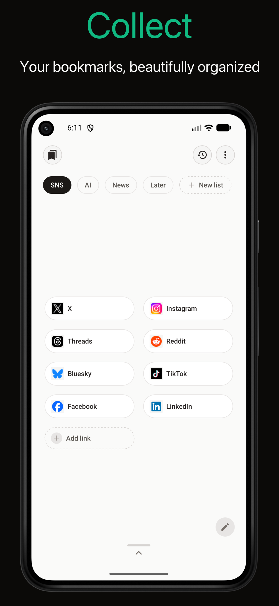
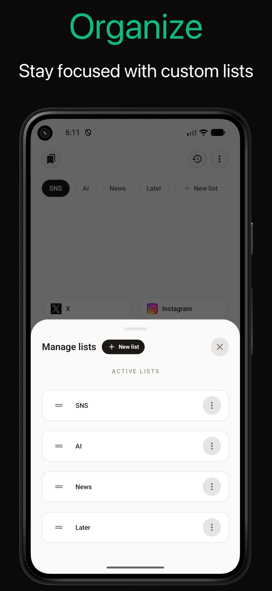
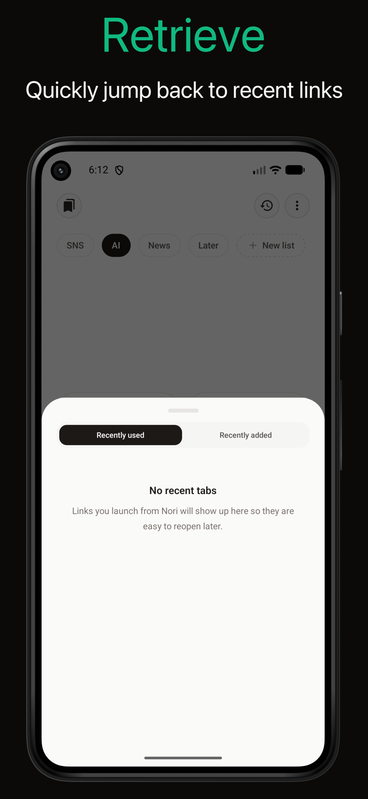
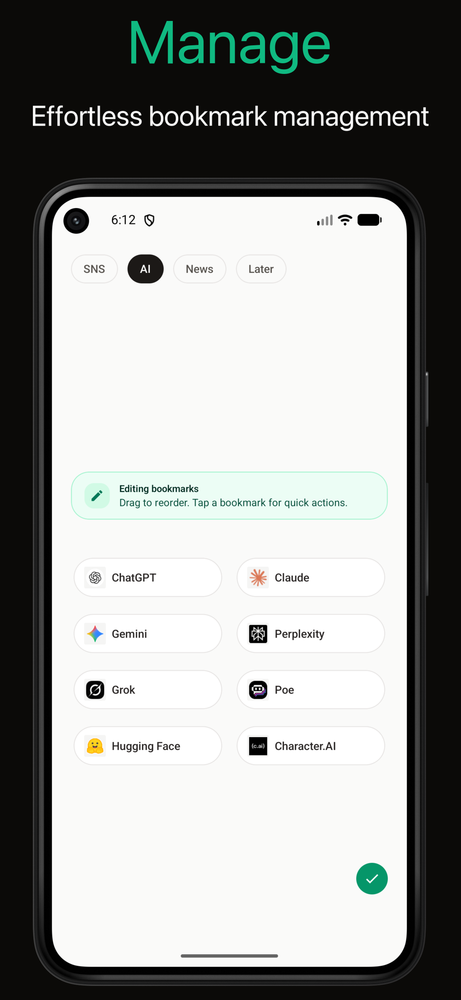

#  Nori

Nori is a bookmark manager and launcher.

## Features

- Organize bookmarks into multiple lists
- Open saved bookmarks in the system browser
- Receive shared links from other apps
- Pick the destination list before saving a shared link

## How it works

- Android opens bookmarks through Custom Tabs via `expo-web-browser`.
- iOS opens bookmarks through the native browser sheet from the same API.

## Screenshots

   

## Development

```sh
bun install
bun run start
```
