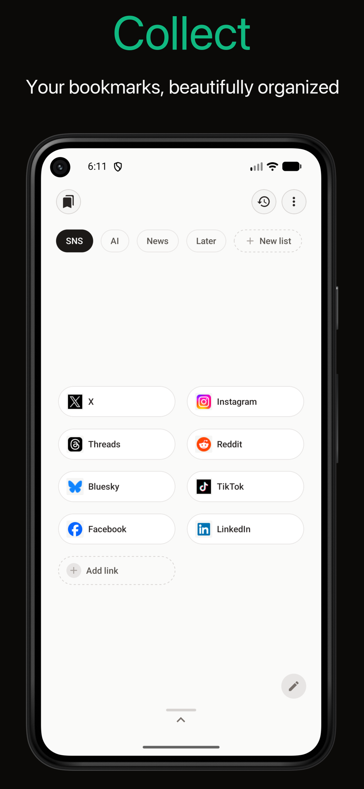
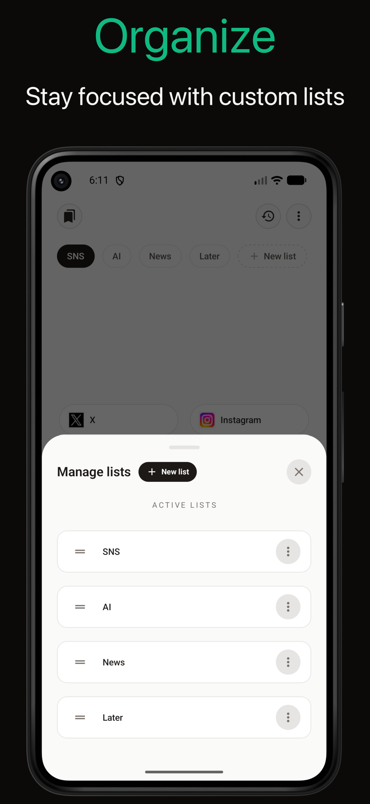
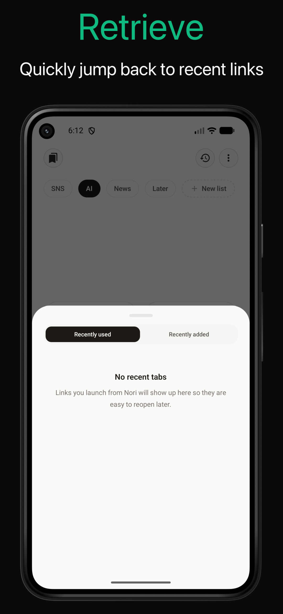
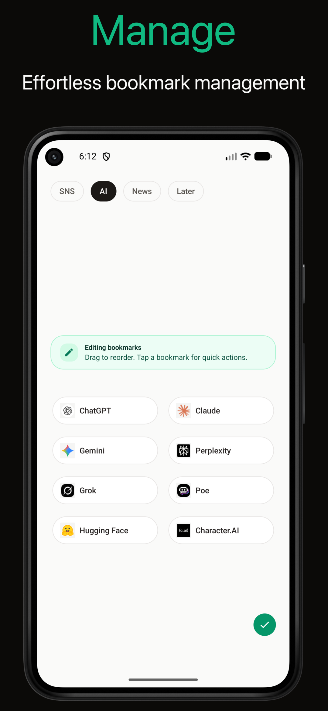

#  Nori

Nori is a bookmark manager and launcher.

Install from App Store, Google Play, or download APK from GitHub.

[](https://apps.apple.com/us/app/nori-bookmark-manager/id6761264972)
[](https://play.google.com/store/apps/details?id=jp.nonbili.nori)
[](https://github.com/nonbili/Nori/releases/latest)

<details>
<summary>AppImage notes</summary>

The Linux AppImage and tarball use the system WebKit, so they need GTK 3 and
`webkit2gtk-4.1` installed (`libwebkit2gtk-4.1-0` on Debian/Ubuntu,
`webkit2gtk4.1` on Fedora, `webkit2gtk-4.1` on Arch).

</details>

## Features

- Organize bookmarks into multiple lists
- Open saved bookmarks in the system browser
- Receive shared links from other apps
- Pick the destination list before saving a shared link

## How it works

- Android opens bookmarks through Custom Tabs via `expo-web-browser`.
- iOS opens bookmarks through the native browser sheet from the same API.

## Screenshots

   

## Development

```sh
bun install
bun run start
```

### Browser extension

Nori also includes a local-first Chrome and Firefox extension whose popup mirrors the Android app: lists, search drawer, history, list management and settings all live in the popup.

```sh
cd extension
bun run dev
bun run dev:firefox
bun run check
bun run build:all
```
